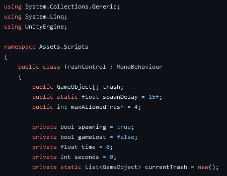
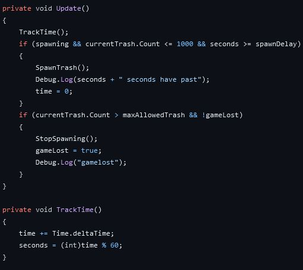
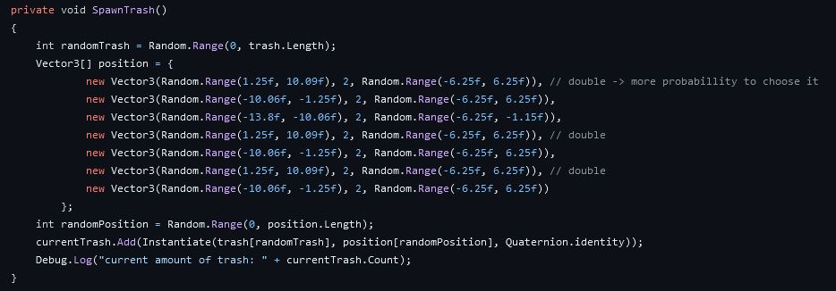
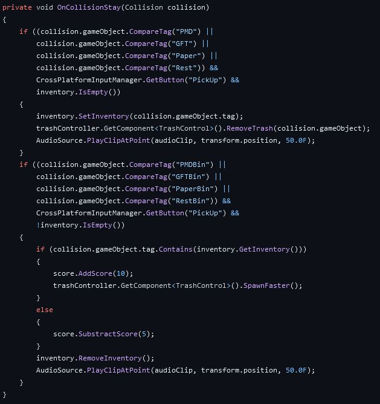
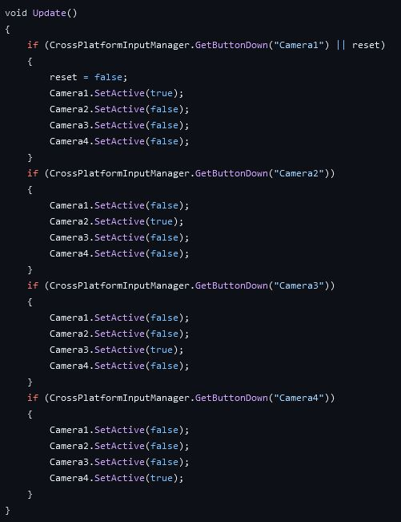
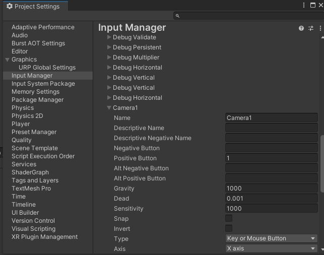
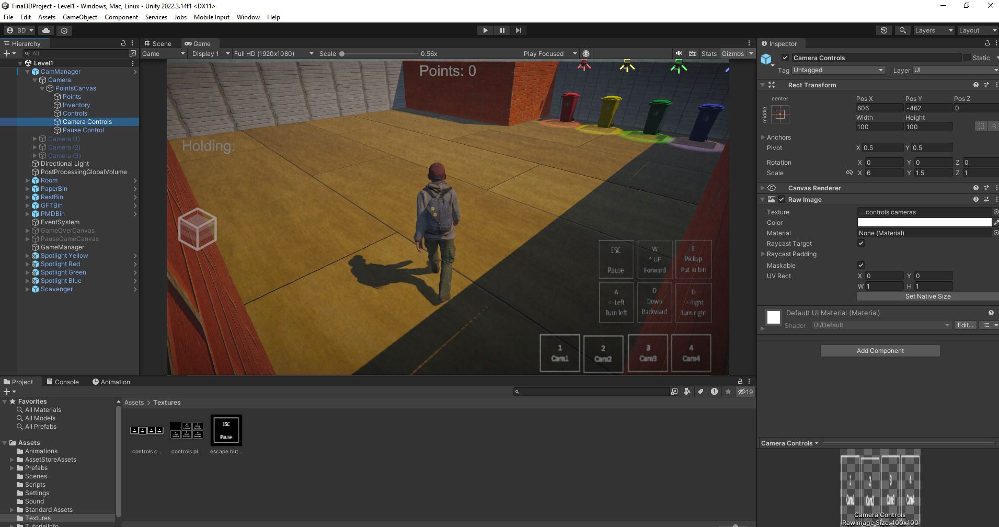
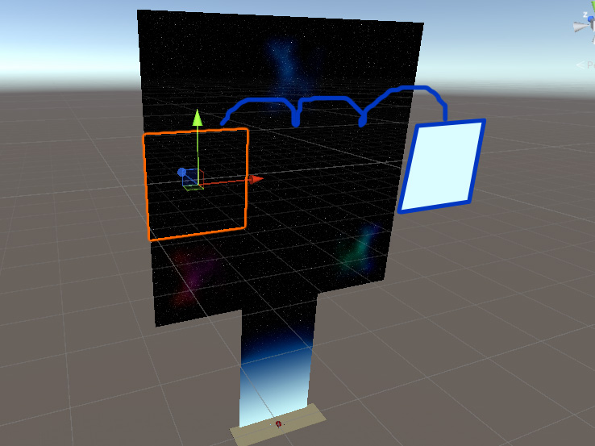

# Final Project 3D Game Development

Hier kan alle extra informatie vinden over de onze game. Onze game zal gaan over de Sustainable development goals, meer bepaald over (ruimte)afval en sorteren. De game bestaat uit 3 levels die elks een eigen minigame voorstellen. Hieronder kan u meer info vinden over de verschillende levels, belangrijke code en controls.

## Level 1

### Beschrijving

Het eerste level gaat over afval opruimen en sorteren. Het doel is om het afval zo snel mogelijk weg te doen. Het afval zal op random locaties genereren in de kamer elke 15 seconden. Dan moet u het afval oprapen en in de juiste vuilniscontainer stoppen. Elke keer dat een stuk afval in de juiste container gestoken wordt zal uw scoren met 10 stijgen en zal te tijd van spawning versnellen. Als u het in de foute vuilniscontainer steekt zal uw score met 5 dalen en gebeurt er niets met de spawn tijd. Als u te traag het afval weg doet en het blijft opstapelen zal u de game verliezen. Dit zal gebeuren wanneer er 20 stukken afval aanwezig zijn (opgeraapt afval telt niet).

### Controls

De game ondersteunt volgende controls:

- ESC => Pauzeer de game
- W => Wandel vooruit
- S => Wandel achteruit
- A => Draai naar links
- D => Draai naar rechts
- E => Raap afval op of drop het in de container
- 1 (niet op nummerpad) => Camera 1
- 2 (niet op nummerpad) => Camera 2
- 3 (niet op nummerpad) => Camera 3
- 4 (niet op nummerpad) => Camera 4

Extra info voor het sorteren:

- Wanneer het afval opgeraapt wordt zal links in het scherm "Holding: item" in dezelfde kleur komen te staan als de vuilniscontainer waar het afval in thuis hoort.

### Belangrijkste code blokken

De belangrijkste codeblokken in level 1 zijn de volgende:

- Random afval spawner
- Sorteren
- Na 20 items afval game over
- Switching cameras
- Foto toevoegen voor controls

#### Random afval spawnen

Om een afval generator te maken moeten we eerst een lijst van afval gameobjecten toevoegen aan het script. Door dit in een lijst op te slagen wordt het gemakkelijker om hier een willekeurig object uit te kiezen.

We zullen ook een spawndelay nodig hebben om te specifiëren hoe snel we willen dat het afval genereerd. Hierbij horen ook nog de time en seconds variabelen om op te slagen hoeveel tijd er voorbij gegaan is.

Vervolgens is er ook nog een aantal variabelen die ervoor gaan zorgen dat de speler zal verliezen en hoe de game hiermee moet omgaan. MaxAllowedTrash geeft het maximum toegestane afval weer en zal ervoor zorgen dat als de list van gespawned afval, currentTrash, groter is dan de gegeven lengte de speler de game verliest. Het verliezen van de game wordt opgeslagen in de game lost variabele. de spawning variabele wordt gebruikt om het spawnen uit of aan te zetten naargelang de game verloren of gepauzeerd is of niet.

CurrentTrash is een statische lijst wegens het anders instantie afhankelijk is en dus niet werkt voor onze toepassing.



Vervolgens moeten we de currentTrash lijst en spawndelay instantiëren in de start functie. Dit zal ervoor zorgen dat als de game (her)start wordt de game juist ingesteld wordt.


Daarna komen we aan de updatefunctie van ons script. Dit is eigenlijk de functie die alles zal sturen en dus zeer belangrijk is. In deze functie roepen we eerst een andere functie, namelijk TrackTime, op die de timing in het oog zal houden van de spawner. Vervolgens kijken we na of er niet te veel objecten aanwezig zijn in onze scene, voor fps redenen, en of de tijd van de spawndelay nog niet verstreken is. Indien dit het geval is zal een nieuw stuk afval gespawned worden via SpawnTrash.

Daarna kijken we na of het maximaal ingesteld afval overschreden is en als dat ook is gebeurd zal de spawner stopen met spawnen en gaat gameLost op true komen te staan.



Tenslotte komen we bij de belangrijkste functie, de spawnfuctie zelf. Hier gaan we eerst een random kiezen tussen al de mogelijke afval objecten. Vervolgens gaan we een random positie in de kamer kiezen. Hiervoor hebben we de kamer opgesplitst in 4 delen waarvan 3 gebruikt gaan worden voor het spawnen, het ongebruikte deel is voor de vuilniscontainers zelf waar dus geen afval mag komen.

We maken dus eeen vector3 array aan met random posities in per deel van de ruimte. Zo vul je de array met vectors waarvan de x en y posities een random zijn van de min en max values voor dat deel van de kamer. Je kan ook bepaalde vectors dupliceren om zo de kans te vergroten om in een bepaald deel te spawnen, zoals hier geïmplementeerd is om zo te voorkomen dat al het afval in het kleine deel spawned en dus meer verspreid is over de grotere ruimtes.

Tenslotte gaan we nog een random van die positie vector kiezen en maken we een afval instantie aan van het eerder gekozen object met als posities de random gekozen posities en we voegen dit dan toe aan de currentTrash lijst.



#### Sorteren

Het sorteren van afval is ook een belangrijk deel van onze game. Hiervoor gaan we gebruik maken van tags. Zo geven we al het afval een gepaste tag naargelang bij welk soort afval het thuis hoort, dit is hoofdlettergevoelig! Zo hebben we voor het afval de tags: PMD, GFT, Rest en Paper.

Voor de vuilniscontainers gaan we hetzelfde doen maar dan met "Bin" achter de tags geschreven. De tags hier zullen dan zijn: PMDBin, GFTBin, RestBin en PaperBin.

Vervolgens gaan we het sorteren zelf toepassen. Zo gaan we wanneer de speler collides met afval eerst nakijken welk afval dit is en dit opslagen in zijn inventory. Het afval zal dan ook verwijderd worden van het speelveld. Daarna gaan we wanneer de speler collides met de vuilniscontainer eerst nakijken welk afval de speler vast heeft en dit vergelijken met de container waar de speler met gecollided is. Als de container de tag van het afval in zijn naam heeft, zoals "PMD" voor het afval en "PMDBin" voor de container, Zal de speler 10 punten krijgen. Indien het niet overeenkomt zal de speler 5 punten verliezen. Tenslotte verwijderen we het afval uit zijn inventory.



#### Switching cameras

Ook het switchen van camera’s is een deel dat onze game niet zonder kan, de speler moet namelijk altijd zijn karakter in beeld kunnen hebben. Daarom hebben we een systeem dat de zal wisselen tussen de camera’s. Dit is een vrij simpele functie waar we gewoon afhankelijk van welke camera actief moet zijn de camera’s gaan activeren of uitschakelen.



Dit wordt gestuurd door de Camera buttons die we declareren in de crossplatform inputmanager.


#### Foto toevoegen voor controls

Als laatste laten we ook nog de controls zien op de eerste camera zodat de speler altijd weet hoe hij de game moet spelen. Dit doen we door een RawImage object toe te voegen als child van de gewenste camera. Tenslotte voegen we de foto toe als texture aan de RawImage component van dit object.



### Assets

De assets gebruikt in level 1 zijn:

- Spotlight and Structure by SPACEZETA
- Free Scavenger by PAUL N.
- Junkyard Car Parts by GADE EMBOSSED
- Cardboard Boxes Pack HD by NOTANOTHERAPOCALYPTICCO.
- Plastic Trash Bins by SPACEZETA
- Trash Low Poly Cartoon Pack by BLANKFACESTANISLAV
- World Materials Free by AVIONX
- Mess Maker Free by THE QUANTUM NEXUS (alleen maar voor de afval prefabs, spawning is zelf gemaakt)

## Level 2

### Beschrijving

Het tweede level focust op het correct sorteren van afval. Je begint met vier verschillende vuilbakken en een stukje vuilnis dat boven één van deze vuilbakken zweeft. Het is aan de speler om het vuilnis boven de juiste vuilbak te plaatsen en ze vervolgens erin te gooien, hierna zal een nieuw stukje vuilnis verschijnen en herhaalt het proces. Het doel van dit level is niet slechts recreatief maar ook educatief: men wil de speler beter leren sorteren en ook van hun sorteerkennis bewust maken.<br>
Hoe hoger de score van de speler, hoe moeilijker het spel wordt.

### Controls

De speler heeft nood aan slechts enkele controls:

* ESC => Pauzeert de game
* LARROW => Vuilnis verplaatst een vuilbak naar links
* RARROW => Vuilnis verplaatst een vuilbak naar rechts
* SPACE => Laat het vuilnis in de vuilbak vallen
* LMB => Menu navigatie

### Belangrijkste code blokken

* Random afval maker
* Countdown timer and Game Over screen
* Difficulty adjusters:
    * Add extra bin/trash
    * Remove icons/text
    * Rotate Camera
    * Open/Close lids
* OnTriggerEnter Collider

#### Random afval maker

Telkens als er een stuk afval in een vuilbak valt, correct gesorteerd of niet, moet er een nieuwe en willekeurig stuk afval op het scherm tevoorschijn komen. Dit stuk zal ook altijd boven een willekeurige vuilbak spawnen.<br><br>
We beginnen in de Start() functie van het LevelManager script, namelijk met het aanmaken van een GameObject list, deze bevat alle content in de Resources/TrashPrefabs folder, hier zitten prefabs in van alle mogelijke varianten afval die kunnen spawnen op niveau 0. We voeren daarna direct de MakeTrash() functie uit.

```C#
trashVar = new List<GameObject>(Resources.LoadAll<GameObject>("TrashPrefabs")); // load resource folder
MakeTrash();
```
In de MakeTrash() functie zullen we twee random getallen genereren; eentje voor de willekeurige vuilbak waar men boven gaat spawnen, en eentje voor het willekeurige afvalobject. Hiermee gaan we een nieuw afval object instantiëren (binPos is een lijst die alle z-as posities van elke actieve vuilbak bijhoudt).
```C#
int randomPos = Random.Range(0, binAmount); // generate random starting position for new trash
int randomTrash = Random.Range(0, trashVar.Count); // generate random trash variant
GameObject newTrash = Instantiate(trashVar[randomTrash], new Vector3(10.5f, 1.5f, binPos[randomPos]), trashVar[randomTrash].transform.rotation);
```
Vervolgens geven we elk nieuw aangemaakt object een spherecollider met isTrigger enabled, een rigidbody met gravity disabled (we willen namelijk dat de space knop de gravity enabled zodat het afval automatisch in de vuilbak valt) en ook voegen we het MoveTrash script toe of enablen we het.
```C#
// make trigger if missing and enable it
if (newTrash.GetComponent<SphereCollider>() == null)
{
    newTrash.AddComponent<SphereCollider>();
    newTrash.GetComponent<SphereCollider>().isTrigger = true;
}

// make rigidbody if missing
if (newTrash.GetComponent<Rigidbody>() == null)
{
    newTrash.AddComponent<Rigidbody>();
}

newTrash.GetComponent<Rigidbody>().useGravity = false; // disable gravity

// add MoveTrash script if missing
if (newTrash.GetComponent<MoveTrash>() == null)
{
    newTrash.AddComponent<MoveTrash>();
}
// if not missing reactivate the script
else
{
    newTrash.GetComponent<MoveTrash>().enabled = true;
}
```

#### Countdown Timer

Bovenaan de Update functie van het LevelManager script voegen we volgende code toe om de level timer te laten aftellen en te updaten.

```C#
// countdown if timer is higher than zero
if (Mathf.FloorToInt(timer) > 0)
{
    timer -= Time.deltaTime;
    timerText.text = $"Time left = {Mathf.FloorToInt(timer)}"; // write timer to canvas
}
```
In het StateManager wordt dan volgende code toegevoegd in de Playing state switch case om het GameOver scherm te tonen en het level te laten stoppen.
```C#
if (Mathf.FloorToInt(LevelManager.GetComponent<LevelManager>().timer) <= 0)
{
    gameState = GameStates.GameOver;
    GameOverCanvas.SetActive(true);
    Time.timeScale = 0f; // set timescale to 0 to pause level
}
```

#### Difficulty Adjusters

Alle difficulty adjuster code blocks gebeuren in de Update() functie van het LevelManager script.

#### Add extra bin / trash

Wanneer we een bepaalde score bereiken willen we de moeilijkheidsgraad van het spel verhogen, als we bijvoorbeeld naar level 1 en 2 gaan willen we een extra vuilbak toevoegen. We gaan deze dan ook zichtbaar maken en zijn deksel toevoegen aan de allBinLidsList lijst om later in onze animaties te kunnen gebruiken. Omdat we een extra vuilbak toevoegen betekent dit ook dat we extra afval varianten aan onze eerdere trashVar lijst moeten toevoegen. Deze extra varianten worden gehaald uit de folders Resources/Level1TrashPrefabs en Resources/Level2TrashPrefabs respectievelijk. Als laatste schuiven we ook de camera op om ons beeld terug centraal te zetten.<br>
Onderstaande code komt overeen met de code voor niveau 2.

```C#
// reach diff one if score is 5
if (score == 5 && !difficulty1Reached)
{
    binAmount = 5; // add a bin
    glasBin.SetActive(true); // make the new bin visible
    allBinLidsList.Add(glasBin.transform.GetChild(0).gameObject); // add new bin lid to lidlist
    List<GameObject> trashVar1 = new List<GameObject>(Resources.LoadAll<GameObject>("Level1TrashPrefabs")); // load folder with level1 trash
    trashVar = trashVar.Union<GameObject>(trashVar1).ToList<GameObject>(); // unite previous list with the existing one
    binPos.Add(poszLeftBin - spaceBetweenBins * (binAmount - 1)); // add z position of new bin to list
    Camera.transform.position = new Vector3(Camera.transform.position.x, Camera.transform.position.y, Camera.transform.position.z - spaceBetweenBins / 2); // move camera
    difficulty1Reached = true;
}
```

#### Remove Icons/Text

Wanneer we niveau drie bereiken willen we het icoontje met de text van het soort afval op alle vuilbakken laten verdwijnen om het spel moeilijker te maken. We doen dit aan de hand van een array die alle objecten met de tag 'IconText' bevat.

```C#
// reach diff 3 if score is 15
if (score == 15 && !difficulty3Reached)
{
    allBinIconText = GameObject.FindGameObjectsWithTag("IconText"); // array with every IconText
    // make the IconTexts invisible
    for (int i = 0; i < binAmount; i++)
    {
        allBinIconText[i].SetActive(false);
    }
    difficulty3Reached = true;
}
```

#### Rotate Camera

Als de speler tot niveau vier geraakt zullen we de camera draaien en de achterkant van de vuilbakken tonen zodat de speler vanaf nu met inverted controls moet spelen.

```C#
// reach diff 4 if score is 20
if (score == 20 && !difficulty4Reached) {
    Camera.transform.Rotate(0, -180, 0, 0); // rotate the camera to get backview
    Camera.transform.position = new Vector3(14.7f, Camera.transform.position.y, Camera.transform.position.z); // move camera behind bins
}
```

#### Open/Close lids

Wanneer we niveau vier bereiken en bovenstaande code uitvoeren, zitten we met het probleem dat de deksels van de vuilbakken het zicht van het soort afval blokkeren. Dit effect willen we eerder bijhouden voor het laatste niveau, niveau 5. Daarom gaan we een animatie uitvoeren om de deksels meer open te doen, dit is de reden dat we een allBinLidsList hebben aangemaakt en telkens hebben geüpdate wanneer er een nieuwe vuilbak bijkwam. We voegen daarom onderstaande code toe aan bovenstaande if block.

```C#
// play open lid animation
for (int i = 0; i < binAmount; i++)
{
    allBinLidsList[i].GetComponent<Animator>().SetTrigger("open");
}
```

Wanneer we dan niveau 5 bereiken zullen we een soortgelijke animatie afspelen om de deksels weer hoger te krijgen.

```C#
// reach diff 5 if score is 25
if (score == 25 && !difficulty5Reached)
{
    // play close lid animation
    for (int i = 0; i < binAmount; i++)
    {
        allBinLidsList[i].GetComponent<Animator>().SetTrigger("close");
    }
    difficulty5Reached = true;
}
```

#### OnTriggerEnter Collider

In het MoveTrash script roepen we de ingebouwde OnTriggerEnter(Collider other) functie aan, deze bevat drie code blocks:<br>

De eerste speelt een wiggle animation af om de vuilbak te laten bewegen als er iets invalt.

```C#
// play wiggle animation
if (other.transform.parent.parent != null)
{
    other.transform.parent.parent.GetComponent<Animator>().SetTrigger("wiggle");
}
```

Als ons afval collide met een net (dit zijn gameobjects verborgen in de vuilbak) met dezelfde tagname gaan we een particle system afspelen van een gele kleur en een punt toevoegen aan de score met de AddPoint() functie van het LevelManager Script die ook een geluidje afspeelt.

```C#
// If collision with same tag; AddPoint, play the particle effect with select color
if (other.gameObject.tag == tag)
{
    other.transform.GetChild(0).gameObject.GetComponent<ParticleSystem>().startColor = Color.yellow; // change particle color
    other.transform.GetChild(0).gameObject.GetComponent<ParticleSystem>().Play(); // play particle effect
    LevelManager.instance.AddPoint(); // add point to the score text
}
```
```C#
public void AddPoint()
{
    // play audio if point is gained
    if (audioGainPoint)
    {
        if (gameObject.GetComponent<AudioSource>())
        {
            gameObject.GetComponent<AudioSource>().PlayOneShot(audioGainPoint);
        }
        else
        {
            AudioSource.PlayClipAtPoint(audioGainPoint, Camera.transform.position);
        }
    }
    score += 1; // add to score
    scoreText.text = score.ToString(); // write score to canvas
}
```

Als ons afval collide met een net (dit zijn gameobjects verborgen in de vuilbak) met verschillende tagname gaan we een particle system afspelen van een rode kleur en een punt afnemen van de score met de LosePoint() functie van het LevelManager Script die ook een geluidje afspeelt.

```C#
// If collision with other tag; LosePoint, play the particle effect with select color
else if (other.gameObject.tag != tag)
{
    other.transform.GetChild(0).gameObject.GetComponent<ParticleSystem>().startColor = Color.red; // change particle color
    other.transform.GetChild(0).gameObject.GetComponent<ParticleSystem>().Play(); // play particle effect
    LevelManager.instance.LosePoint(); // reduce point from the score text
} 
```
```C#
public void LosePoint()
{
    // play audio if point is lost
    if (audioLosePoint)
    {
        if (gameObject.GetComponent<AudioSource>())
        {
            gameObject.GetComponent<AudioSource>().PlayOneShot(audioLosePoint);
        }
        else
        {
            AudioSource.PlayClipAtPoint(audioLosePoint, Camera.transform.position);
        }
    }
    // only lose points if score higher than 0
    if (score > 0)
    {
        score -= 1; // reduce point from score
        scoreText.text = score.ToString(); // write score to canvas
    }
}
```

### Assets

De assets gebruikt in level 2 zijn:

* Stylized Grass Texture by LowlyPoly
* Plastic Trash Bins by SpaceZeta
* FROOD - Free food and drinks pack by VoxelGuy
* 24 PBR Materials for Unity 5 by Epyphany games
* Cola Can by Rodolfo Rubens
* Carton of Milk 4K PBR by GooPi(Misha)
* Trash Low Poly Cartoon Pack by BlankfaceStanislav
* Food FREE by ithappy
* Vertex Color Coffee Props by Chaotic Formula
* Hats Pack | URP by Unity Technologies
* 6 x 3D Cute Toy Models by Psionic Games
* Toon Furniture by Elcanetay
* Free Cans pack by That Individual

## Level 3

### Beschrijving

Het derde level start vanop een ongekende locatie waar kennelijk spinnen leven ter grootte van een halve raket. De bedoeling is om eerst op te stijgen tot je in de ruimte bent. Vanaf je echt in de ruimte bent begint er een timer te lopen van één minuut en is het de bedoeling om tussen al de rotsblokken op zoek te gaan naar oude satellieten. Elke satelliet die je opruimt is goed voor één punt. Je kan vliegen naar waar je maar wil. Je kan dus niet terug naar de planeet waar je net bent opgestegen! Het is in principe een 2D level, maar dan gebouwd in een 3D omgeving. Let goed op de spinnen die elke keer iets anders weglopen en de rotsblokken en satellieten die elk op een aparte manier ronddraaien en bewegen. 

### Controls

De speler heeft nood aan slechts enkele controls:

* LARROW => Draai de raket naar links
* RARROW => Draai de raket naar rechts
* SPACE => Accelereren van raket
* LMB => Menu navigatie

### Belangrijkste code blokken

De belangrijkste codeblokken in level 1 zijn de volgende:

- Achtergrondmuziek met fade-out
- Out of bounds objecten vernietigen
- Once in space
- De ruimte zonder einde

#### Achtergrondmuziek met fade-out

Als muzikant zijnde kon ik het niet laten om toch even een eigen mini soundtrack te schrijven.
De muziek begint te spelen vanaf de timer begint te lopen.
Het stukje muziek duurt ook net lang genoeg om het een volle minuut spannend te maken.
Maar wat als je de raket al vernietigd is voor de muziek klaar is met afspelen?
Dit los ik op met een fade out functionaliteit om het volume geleidelijk te reduceren alvorens de muziek echt te stoppen.

De lengte van het uitfaden kiezen we zelf:

```C#
    public float fadeOutTime = 0.65f;  // Tijd in seconden voor het
```

We gaan aan de hand van een stopfunctie een coroutine oproepen.
We vragen eerst het startvolume van onze audiobron zelf op.
Zolang dit volume groter is dan nul gaan we stelselmatig het volume verminderen.
Na het effectief stoppen gaan we het volume terug herstellen naar het startvolume.

```C#
    public void StopMusic()
    {
        StartCoroutine(FadeOutAndStop());
    }

    System.Collections.IEnumerator FadeOutAndStop()
    {
        float startVolume = audioSource.volume;

        while (audioSource.volume > 0)
        {
            audioSource.volume -= startVolume * Time.deltaTime / fadeOutTime;
            yield return null;
        }

        audioSource.Stop();
        audioSource.volume = startVolume;  // Herstel het volume naar het oorspronkelijke niveau
    }
```

#### Out of bounds objecten vernietigen

Wanneer we in de ruimte vliegen gaan we willekeurig rotsen en satellieten spawnen.
Het is echter niet de bedoeling dat deze objecten het geheugen blijven opvullen.
Anderzijds is het ook niet de bedoeling dat we deze objecten terwijl we rondvliegen spontaan zien verdwijnen.
Vanaf een bepaalde afstand tussen de raket en het object is het de bedoeling dat het object verdwijnt uit ons spel (en het geheugen).

We gaan onze raket die is getagged met "main_character" in ons script gebruiken om in de Update() loop elke keer zijn positie te verkrijgen.
Deze positie wordt dan vergeleken met die van het object waar dit script is op toegepast. Het verschil slaan we ook op in pos_difference.
Wanneer dit Vector3 object, dat het verschil in afstand voorstelt, op de x-as of y-as groter is dan 'bound' (ook negatief!) dan mag het object waar dit script op toegepast is vernietigd worden.

```C#
public class DestroyOutOfBounds : MonoBehaviour
{
    // Start is called before the first frame update
    public float bound = 55.0f;
    private GameObject MainCharacterObject;
    private Vector3 pos_ScriptObject;
    private Vector3 pos_MainCharacterObject;
    private Vector3 pos_difference;
    void Start()
    {
        pos_ScriptObject = transform.position;  // Positie van het object waarop het script is toegepast
        MainCharacterObject = GameObject.FindWithTag("main_character");
        pos_MainCharacterObject = MainCharacterObject.transform.position;
    }

    // Update is called once per frame
    void Update()
    {
        if (MainCharacterObject != null)
        {
            pos_ScriptObject = transform.position;  // Positie van het object waarop het script is toegepast
            pos_MainCharacterObject = MainCharacterObject.transform.position;
            pos_difference = pos_MainCharacterObject - pos_ScriptObject;
            if (pos_difference.x > bound || pos_difference.y > bound || pos_difference.x < -bound || pos_difference.y < -bound)
                Destroy(gameObject);
        }
        else
            Destroy(gameObject);
    }
}
```

#### Once in space

Eens de raket hoog genoeg is en zich dus in de ruimte bevindt is het de bedoeling dat het spel echt begint.
Ik heb hier een speciaal script voor geschreven dat andere scripts als het ware gaat activeren.
Dit gebeurd door de verschillende objecten (scripts) vast te grijpen en hun specifieke boolean die hiervoor aangemaakt is op true te zetten.

Het script controleert de positie van het object (de raket) tot het de hoogte van triggerY heeft overschreden.
Vanaf dat moment gaan dus al de verschillende booleans op true gezet worden en zal er achter de schermen functionaliteit van verschillende scripts ingeschakeld worden.
- Objecten die niet meer nodig zijn zullen vernietigd worden (de lanceerbasis, wolken, spinnen, ...).
- De achtergrondafbeeldingen met sterren zullen kunnen beginnen verschuiven (planes).
- De camera gaat een stukje verder uitzoomen.
- De raket kan nu ook gedraaid worden met arrow keys.
- De spawn manager gaat rotsblokken en satellieten beginnen spawnen.
- De timer begint te lopen.
- De achtergrondmuziek begint af te spelen.

Nadat dit script is uitgevoerd wordt het volledig uitgeschakeld.

```C#
public class OnceInSpace : MonoBehaviour
{
    private Vector3 pos_ScriptObject;
    public bool enableAll = false;
    public float triggerY = 180.0f;
    private DestroyWithBoolean[] destroyScripts; // Lijst om DestroyWithBoolean-scripts op te slaan
    private MoveSprite[] moveSpriteScripts;
    private FollowPlayer followPlayer;
    private PlayerController playerController;
    private ChangeWeightRocket changeWeightRocket;
    private SpawnManager spawnManager;
    private Timer timer;
    private BackgroundMusic music;

    void Start()
    {
        pos_ScriptObject = transform.position;
        destroyScripts = FindObjectsOfType<DestroyWithBoolean>();
        moveSpriteScripts = FindObjectsOfType<MoveSprite>();
        followPlayer = FindObjectOfType<FollowPlayer>();
        playerController = FindObjectOfType<PlayerController>();
        changeWeightRocket = FindObjectOfType<ChangeWeightRocket>();
        spawnManager = FindObjectOfType<SpawnManager>();
        timer = FindObjectOfType<Timer>();
        music = FindObjectOfType<BackgroundMusic>();
    }

    void Update()
    {
        pos_ScriptObject = transform.position;

        if (pos_ScriptObject.y >= triggerY && !enableAll)
        {
            enableAll = true;
            Debug.Log("Once In Space triggered/enabled");

            if (playerController != null)
                playerController.enableSteering = true;

            if (music != null)
                music.enableMusic = true;

            if (timer != null)
                timer.startTimer = true;

            if (changeWeightRocket != null)
                changeWeightRocket.enableWeight = true;

            if (followPlayer != null)
                followPlayer.zoomEnabled = true;

            if (spawnManager != null)
                spawnManager.enableSpawning = true;

            // Activeer alle MoveSprite scripts in de array
            foreach (MoveSprite moveSpriteScript in moveSpriteScripts)
            {
                if (moveSpriteScript != null)
                    moveSpriteScript.activateScript = true;
            }
            foreach (DestroyWithBoolean destroyScript in destroyScripts)
            {
                if (destroyScript != null)
                    destroyScript.enableDestroy = true;
            }

            enabled = false; // disable script
        }
    }
}
```

#### De ruimte zonder einde

Ik heb een eigen systeem uitgewerkt dat de perceptie wekt dat de ruimte eindeloos groot is.
De achtergrond bestaat uit 9 2D planes met 4 verschillende afbeeldingen.
Er is een standaardachtergrond, eentje met een blauwe vlek, groene vlek en rode vlek in verwerkt om variatie te krijgen.
Deze 9 planes kunnen naadloos tegen elkaar worden geplaatst. Dit heb ik zelf gecreëerd met Photoshop.
Het idee was dan om deze planes telkens te laten opschuiven als de raket een bepaalde afstand verwijderd is van een plaat (x-as of y-as, positief of negatief!).
Het komt er dus op neer dat dit script op elke plane is toegepast en dus oneindig gaat doorschuiven.
Het leuke is dat zo de gekleurde variaties soms achter elkaar voorkomen of net helemaal niet.

Het MoveSprite script is dus toegepast op deze planes.
Triggerwaarde is de afstand dat het MainCharacterObject verwijderd moet zijn van het centrum van de plane om de plane te laten verschuiven.
De float 'waarde' zorgt dan weer voor de hoeveelheid verschuiving. Uiteraard heeft deze instelling te maken met de grootte van de planes zodat deze mooi naadloos verschuiven.
Aangezien de planes misschien van grootte zouden veranderen in de toekomst heb ik ervoor gekozen om deze waarden public instelbaar te maken.
Als MainCharacterObject heb ik trouwens Main Camera gekozen in plaats van de raket zelf, omdat uiteindelijk de positie van de camera belangrijker is.
Stel dat we toch met een andere positie van de camera werken dan zou het zomaar kunnen dat we het te laat verschuiven van één van de panelen in beeld krijgen.
De kans is wel klein, maar met veranderingen in gedachte dus gekozen voor de Main Camera in plaats van de raket zelf.

```C#
public class MoveSprite : MonoBehaviour
{

    public GameObject MainCharacterObject;
    public float waarde = 240.0f;
    public float triggerwaarde = 120.0f;
    private Vector3 pos_ScriptObject;
    private Vector3 pos_MainCharacterObject;
    private Vector3 pos_difference;
    public bool activateScript = false;

    // Start is called before the first frame update
    void Start()
    {
        pos_ScriptObject = transform.position;  // Positie van het object waarop het script is toegepast
        pos_MainCharacterObject = MainCharacterObject.transform.position;
    }

    // Update is called once per frame
    void Update()
    {
        if (activateScript)
        {
            pos_ScriptObject = transform.position;  // Positie van het object waarop het script is toegepast
            pos_MainCharacterObject = MainCharacterObject.transform.position;
            pos_difference = pos_MainCharacterObject - pos_ScriptObject;
            if (pos_difference.x > triggerwaarde)
                VeranderXPos(waarde, 1.0f);
            else if (pos_difference.x < -triggerwaarde)
                VeranderXPos(waarde, -1.0f);
            if (pos_difference.y > triggerwaarde)
                VeranderYPos(waarde, 1.0f);
            else if (pos_difference.y < -triggerwaarde)
                VeranderYPos(waarde, -1.0f);
        }


        void VeranderXPos(float waarde, float richting)
        {
            transform.position = new Vector3(transform.position.x + waarde * richting, transform.position.y, transform.position.z);
        }
        void VeranderYPos(float waarde, float richting)
        {
            transform.position = new Vector3(transform.position.x, transform.position.y + waarde * richting, transform.position.z);
        }
    }
}
```




### Assets

De assets gebruikt in level 3 zijn:

* Metal/Sand textures and materials by Epyphany
* Rocks, flowers by Low Poly Space Alien Worlds Assets
* Explosion audio by Free Fireworks
* Jet Engine Particle System by GamedevDreamer
* Spider prefab by SpidersAsset
* Rocket material by YughuesFreeMetalMaterials